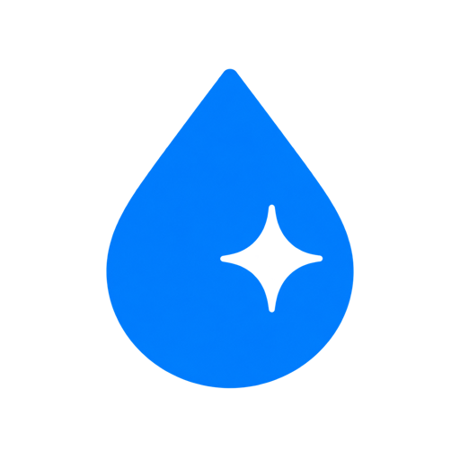

<p align="center">
  
</p>

<h1 align="center">Nacre UI</h1>

<p align="center">A reusable React component library for restrained liquid-glass interfaces.</p>

> Private preview. The API is reusable today, but the package is intentionally protected from public npm publication while it is still being reviewed.

Current preview: **v0.2.0**. See [CHANGELOG.md](./CHANGELOG.md) for release details.

## Design direction

- Glass belongs to controls, navigation, selection lenses, menus, and temporary overlays.
- Reading surfaces stay stable, opaque, and quiet.
- Every glass boundary uses one thin refractive rim—never stacked borders or broad glow.
- Interaction is physical but restrained: local press light, bounded pointer pull, and spring return.
- The accent is a runtime variable. Neutral selection remains neutral.
- Components preserve keyboard, touch, focus, and reduced-motion behavior through React Aria Components.

## Install

The repository is private. Authenticate with GitHub, then install it directly:

```bash
npm install github:Baronyu188/nacre-ui
```

React 18.2+ and ReactDOM 18.2+ are peer dependencies.

## Use

```tsx
import {Button, GlassGroup, Presentation} from '@nacre-ui/react';
import '@nacre-ui/react/styles.css';

export function Actions() {
  return (
    <GlassGroup>
      <Button variant="prominent">Create</Button>
      <Presentation trigger="Inspect" title="Details">
        Reusable overlay content.
      </Presentation>
    </GlassGroup>
  );
}
```

Set the theme color on the document root so menus, dialogs, and drawers rendered through portals inherit it:

```ts
document.documentElement.style.setProperty('--nacre-accent', '#0a84ff');
document.documentElement.style.setProperty('--nacre-accent-rgb', '10, 132, 255');
```

## Components

- Material and actions: `GlassSurface`, `GlassGroup`, `LiquidGlassSurface`, `PerspectiveCard`, `Button`, `LiquidGlassButton`
- Forms and selection: `Field`, `TextAreaField`, `SearchInput`, `PasswordField`, `NativeDateInput`, `Select`, `ComboBox`, `Switch`, `Checkbox`, `RadioCards`, `Range`, `NumberInput`, `Tags`, `Tabs`, `SegmentedControl`
- Navigation and application chrome: `DesktopNavigation`, `MobileNavigation`, `BreadcrumbTrail`, `ActionMenu`, `MenuBar`, `MenuButton`, `ContextMenu`, `CommandPalette`, `Toolbar`, `Pagination`, `FileDrop`, `ColorPicker`
- Structure and overlays: `Accordion`, `InfoPopover`, `Hint`, `Presentation`, `AdaptiveSheet`, `AlertDialog`, `Toast`, `NotificationCenter`
- Content and feedback: `Card`, `CardSkeleton`, `SettingsCard`, `DataTable`, `Progress` (determinate or indeterminate), `MeterBar`, `Badge`, `Notice`, `Skeleton`, `EmptyState`, `Avatar`, `StatusDot`, `Kbd`, `Separator`
- Chat and agents: `ConversationList`, `ChatMessage`, `ChatComposer`, `AgentComposer`, `AgentThinking`, `AgentProgressSidebar`

## Gallery and package

```bash
npm install
npm run dev
```

```bash
npm run check
npm run build:lib
npm run verify:package
```

The package build emits ESM, a shared stylesheet, and TypeScript declarations under `dist-lib/`. It uses standard CSS masking, backdrop filters, SVG, Pointer Events, and requestAnimationFrame; no Chrome experimental flag is required.

## Agent Skill

The repository includes [`$nacre-ui`](./.agents/skills/nacre-ui/SKILL.md). It routes agents to the maintained material, motion, component, accessibility, and implementation rules before they change the library.

## License

MIT. See [THIRD_PARTY_NOTICES.md](./THIRD_PARTY_NOTICES.md) for dependency and design-reference notices.
